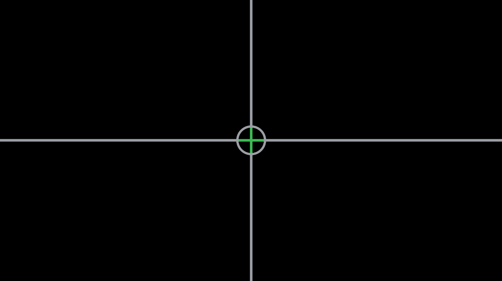

# TwoModel

Sure, let's create a new experiment. What are we doing here? We have two models we want to investigate. Namely, these are: a Human Pilot model and Fitt's Law. How do people perform under different dynamics? How is their learning different?

Notes:
3 groups of subjects
~10 subjects per group

each group has different dynamics
K, K/s, K/s^2

5 days in a row, MTuWThF
~30 minutes per day
15 minutes doing a 1D tracking task
15 minutes doing a 2D fitts task

